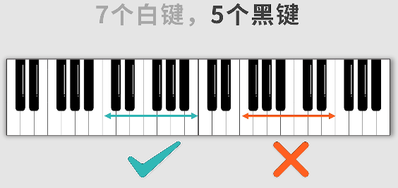
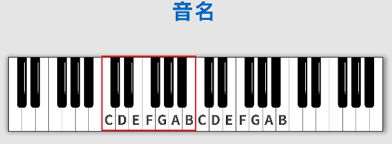
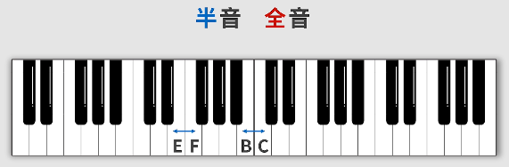
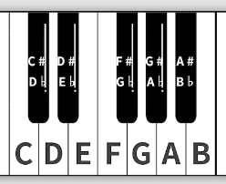
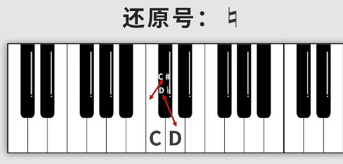
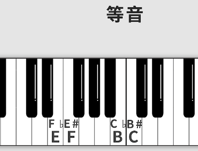
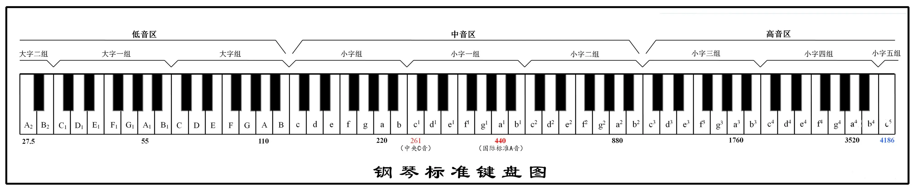

# 音名与钢琴键盘

## 1 钢琴键盘

使用钢琴键盘学习乐理事半功倍。

**音左低右高**。

去掉最左侧的3个键和最右侧的1个键。

还剩下`88-4 = 84`个键位

因此按照一组12个键位划分，可以分为7组。

而一组有7个白键，5个黑键。

### 1.1 白键音名

## 2. 升降号、还原号

### 2.1 半音与全音

* 半音：键之间若没有1个键 在其中，即两个键相邻。
* 全音：键之间若有1个键存在，即两个键之间不相邻且只有1个键阻挡。

除了上图中显示的白键之间为半音，其它白键之间都为全音，白键与黑键之间为半音。

### 2.2 黑键音名

靠近白键`C`的右边黑键比`C`高半音。

记为`C#`，读作**升C**。

>键盘音左低右高，因此记为**升**

该黑键同时也紧邻`D`键，比`D`低半音，

可记为`D♭`，读作**降D**。

>总结：一个黑键两个音名。

### 2.3 还原号

虽然黑键有两个音名，但不能任意选一个音名作为黑键的音名。

还原号：`♮`

它可以将黑键的音名进行还原，如下图。

* 写的`C#`，可以还原成`C`音,
* 写的`D♭`，可以还原成`D`音

### 2.4 等音

`F♭`与`E`是等音，
`E#`与`F`是等音。
>B、C同理。

通过使用还原号，可以很方便地将一个音进行半音的升降。

### 2.5 重升、重降

五线谱出现的比较多。

* 重升：升两个半音，
* 重降：降两个半音，`♭♭`

## 3. 区分同一音名的不同键位

