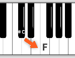

# 音程

入门**和声**的第1课。

在本章之前讲的都是**单音**演奏，即同时只发一个音（只按1个键）。

而加入和声（同时按多个键），能让音乐更饱满，说白了就是更好听。

## 1. 概念

* 音程：两个音之间的距离，单位为度。
* 计算方式：有几个白键就是多少度，包括两个音自己，见下图（C到A的音程）。
* 左边的音：根音（下方音）
* 右边的音：冠音（上方音）
* 冠音应始终比根音的音级要高


>音程具有方向性，只能从左往右，如下图：
>
>
>
>计算C-A的音程时，只能从C往右查找到A这之间的距离，但不能说成是从A-C之间的音程，从A到C的音程是从A往右找到C。

### 1.1 存在黑键的音程计算

黑键的音名是通过添加`升`、`降`符号，在白键的基础上获得的。

因此需要通过**还原号**将其还原成对应的白键，再计算音程。

如下例，计算`D#`(升D)到`B♭`(降B)的音程:


将两个音名分别还原成`D`和`B`，然后计算白键之间的距离即可。


## 2. 音程的属性

给两个相同音程的例子，

* `#C`到`E`：3度（音程）
* `C`到`E`：3度（音程）

可见，同样是3度，但实际上它们两个的距离是不一样的（C和C#一个是白键，一个是黑键，它们分别与E的音数是不一样的）。

>音数：音程中两个音之间包含的全音或者说半音的数量。

### 2.1 自然音程

根据`X1`到`X2`之间半音数量的不同，可以将分为**纯、大、小等几度音程**：

半音数|0|1|2|3|4|5|6|7|8|9|10|11|12
:-:|:-:|:-:|:-:|:-:|:-:|:-:|:-:|:-:|:-:|:-:|:-:|:-:|:-:
音程（自然）|纯一度|小二度|大二度|小三度|大三度|纯四度|增四/减五度|纯五度|小六度|大六度|小七度|大七度|纯八度

可简单记为：**一四五八都是纯，二三六七有小大。**

*注意*：计算半音数量前，

1. 若有黑键，需要先还原成白键，然后计算白键的个数，即**度数**，
2. 此时再看原键之间的半音个数，根据上述表格找到对应的**音程数的度数**，

若两者相等，此时该音程为自然音程，否则是[变化音程](#22-变化音程)。

举例说明：

#### 2.1.1 例1



此时计算`#C到F`的音程，根据上述规则，
   
1. 应先还原`#C`为C，然后C到F为四度，
2. 再计算#C到F的半音个数为4，根据表格为大三度

四度与三度不等，因此该#C到F的音程为变化音程。

#### 2.1.1 例2


此时计算`♭D到F`的音程，根据上述规则，
   
1. 应先还原`♭D`为D，然后D到F为三度，
2. 再计算♭D到F的半音个数为4，根据表格为大三度

都为三度，因此该♭D到F的音程为自然音程，且为**大三度**。

>了解：根据音程的不同，可以分别命名为：
>
>音程别名|具体音程
>:-:|:-:
>完全协和音程|纯一度、纯八度
>协和音程|纯四度、纯五度
>不完全协和音程|小大三度、小大六度
>不协和音程|小大二度、小大七度、增四/减五度

### 2.2 变化音程

除自然音程之外的都是变化音程。

#### 2.2.1 增音程

**纯**、**大**音程之间的距离**增加**一个半音。

原音程|增加一个半音
:-:|:-:
C-C：纯一度|C-C#：增一度
C-E：大三度|C-E#、C♭-E：增三度

#### 2.2.2 减音程

**纯**、**小**音程之间的距离**减少**一个半音。

原音程|减少一个半音
:-:|:-:
E-F：小二度|E#-F、E-F♭：减二度

上一小节中的[例1](#211-例1)，计算C#-F的音程，通过对比知道该音程是变化音程，因此先计算C-F的音程为纯四度，减少一个半音便是C#-F，为**减四度**。

#### 2.2.3 倍增、倍减

* 倍增：音程**增加**两个半音；
* 倍减：音程**减少**两个半音。

**例1**：

小二度|减二度|倍减二度
:-:|:-:|:-:
E-F|E-F♭|E-F♭♭、E-E♭

其中**倍减二度**中，打破了冠音应该比根音高的原则，因此该倍减二度不存在。

**例2**：

大七度|增七度|倍增七度
:-:|:-:|:-:
C-B|C-B#|C-Bж

#### 2.2.4 等音程

* 唱名同
* 音数同
* 度数不同

```
E-F♭==E-E              度数：前者2，后者1
C-B#==C-C(高音)        度数：前者7，后者8
```

## 3. 音程总结


## 4. 快速记忆音程

通过以C推导出的音程规律，推出相关记忆规律。

即记忆**度数**（若有黑键需还原）和**键的个数**来确定自然音程和变化音程。

>只要确定度数和键的个数便能快速知道纯、大、小等几度音程。

<table align="center">
    <tr>
        <th></th>
        <th colspan="4">{倍减}[减]纯[增]{倍增}</th>
        <th colspan="4">{倍减}[减](小)大[增]{倍增}</th>
    </tr>
    <tr>
        <td>度数</td>
        <td>1</td>
        <td>4</td>
        <td>5</td>
        <td>8</td>
        <td>2</td>
        <td>3</td>
        <td>6</td>
        <td>7</td>
    </tr>
    <tr>
        <td>键个数</td>
        <td>[0]1[2]{3}</td>
        <td>{4}[5]6[7]{8}</td>
        <td>{6}[7]8[9]{10}</td>
        <td>{11}[12]13[14]{15}</td>
        <td>{0}[1](2)3[4]{5}</td>
        <td>{2}[3](4)5[6]{7}</td>
        <td>{7}[8](9)10[11]{12}</td>
        <td>{9}[10](11)12[13]{14}</td>
    </tr>
    <tr>
        <td>C-</td>
        <td>C</td>
        <td>F</td>
        <td>G</td>
        <td>高音C</td>
        <td>D</td>
        <td>E</td>
        <td>A</td>
        <td>B</td>
    </tr>
</table>

### 4.1 例子(大)


`#C-F`先还原#C到C后，**度数为4**，有**5个键**，表格中没有对应。

而`♭D-F`还原♭D为D,**度数为3**，有**5个键**，按照上述表格，为**大三度**。

### 4.2 例子(小)

`A-C`,**度数为3**，有**4个键**，按照表格为**小三度**。

### 4.3 例子(减)

`C-♭F`,**度数为4**，有**5个键**，按照表格为**减四度**。

`A-♭C`,**度数为3**，有**3个键**，按照表格为**减三度**。

### 4.4 例子(增)

`C-#F`,**度数为4**，有**7个键**，按照表格为**增四度**。

`C-#E`,**度数为3**，有**6个键**，按照表格为**增三度**。

### 4.5 记忆总结


## 5. 音程实战

1. `#C-♭A`:6度,8个键,**减六度**
2. `E-♭F`:2度,1个键,**减二度**