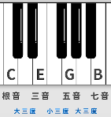
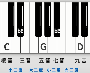
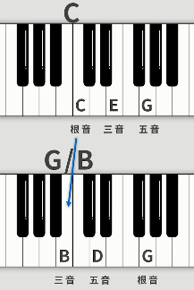

# 乐名与和弦

## 1. 乐名

以C大调为例，乐名如下：

乐名|主音|上主音|中音|下属音|属音|下中音|导音
:-:|:-:|:-:|:-:|:-:|:-:|:-:|:-:
音名|C|D|E|F|G|A|B
唱名|do|re|mi|fa|sol|la|si
简谱|1|2|3|4|5|6|7

由以下3个乐名构成的和弦最为重要：

1. 主音：主和弦
2. 下属音：下属和弦
3. 属音：属和弦

99%的流行曲子旋律最后都会回到主音，和弦上回到主和弦。

## 2. 和弦

三个及三个以上**不同音**构成的，称为和弦。

### 2.1 三和弦

>最常见的和弦。

概念：三个音按**三度关系**叠加的和弦。

* 三音：
  1. 根音：决定和弦的本质，是**最低音**（原位和弦）
  2. 三音：根音上方三度音。
  3. 五音：根音上方五度音。
* 和弦：
  1. 大三和弦，
  2. 小三和弦，
  3. 减三和弦，
  4. 增三和弦。

#### 2.1.1 大三和弦

组成：
```
根音        三音        五音
  \_________/ \_________/
     大三度      小三度
```

如**C大三和弦**，常用一个字母代替，写作**C**：


>**D大三和弦**，写作**D**。

#### 2.1.2 小三和弦

组成：
```
根音        三音        五音
  \_________/ \_________/
     小三度      大三度
```

如**C小三和弦**，一般写作**Cm**，读作`C minor和弦`。


#### 2.1.3 减三和弦

组成：
```
根音        三音        五音
  \_________/ \_________/
     小三度      小三度
```

如**C减三和弦**，一般写作**Cdim**，读作`C diminished和弦`。


#### 2.1.4 增三和弦

组成：
```
根音        三音        五音
  \_________/ \_________/
     大三度      大三度
```

如**C增三和弦**，一般写作**Caug**，读作`C augmented和弦`。


#### 2.1.5 本调和弦

C大调中，各音名皆为白键，

因此若在该大调中，以各音名为首，且都是白键组成的三和弦，称之为**本调和弦**。

>本调和弦：和弦组成的音名既没有升也没有降，
>离调和弦：有升降。

1. **C**EG（1级）：大三和弦（主和弦）
2. **D**FA（2级）：小三和弦
3. **E**GB（3级）：小三和弦
4. **F**AC（4级）：大三和弦（下属和弦）
5. **G**BD（5级）：大三和弦（属和弦）
6. **A**CE（6级）：小三和弦
7. **B**DF（7级）：减三和弦

### 2.2 七和弦

概念：四个音按**三度关系**叠加的和弦。

* 四音：
  1. 根音：决定和弦的本质，是**最低音**（原位和弦）
  2. 三音：根音上方三度音。
  3. 五音：根音上方五度音。
  4. 七音：根音上方七度音。
* 和弦：
  1. 大七和弦：  大三和弦+大三度，
  2. 大小七和弦：大三和弦+小三度，
  3. 小七和弦：  小三和弦+小三度，
  4. 小大七和弦：小三和弦+大三度，
  5. 减七和弦：  减三和弦+小三度，
  6. 半减七和弦：减三和弦+大三度。

>流行歌曲常用的七和弦为：
>1. 大七和弦
>2. 小七和弦
>3. 大小七和弦

#### 2.2.1 大七和弦

组成：
```
根音        三音        五音        七音
  \_________/ \_________/ \_________/
     大三度      小三度      大三度
```

如**C大七和弦**，一般写作**Cmaj7**，读作`C major7和弦`。



#### 2.2.2 大小七和弦

组成：
```
根音        三音        五音        七音
  \_________/ \_________/ \_________/
     大三度      小三度      小三度
```

如**C大小七和弦**，一般写作**C7**。


**属七和弦**

若某大调的第5个音，即**属音**，以它为根音构成大小七和弦，那么这个和弦称为：`某大调的属七和弦`。

以上图为例，C为根音，但却是F大调的属音，因此可以称`CEGB`为F大调的属七和弦。

1. 每个调只有一个属音，即每个调只有一个`属七和弦`，其它都称为`大小七和弦`。
2. 一个调式里除了`属七和弦`（本调），其它`大小七和弦`都有离调音。

#### 2.2.3 小七和弦

组成：
```
根音        三音        五音        七音
  \_________/ \_________/ \_________/
     小三度      大三度      小三度
```

如**C小七和弦**，一般写作**Cmin7**，读作`C minor7和弦`。


#### 2.2.4 小大七和弦

组成：
```
根音        三音        五音        七音
  \_________/ \_________/ \_________/
     小三度      大三度      大三度
```

如**C小大七和弦**，一般写作**CmM7**。


#### 2.2.5 减七和弦

组成：
```
根音        三音        五音        七音
  \_________/ \_________/ \_________/
     小三度      小三度      小三度
```

如**C减七和弦**，一般写作**Cdim7**。


上图七音必须是`♭♭B`，若是`A`，则与五音构不成三度关系。

#### 2.2.6 半减七和弦

组成：
```
根音        三音        五音        七音
  \_________/ \_________/ \_________/
     小三度      小三度      大三度
```

如**C半减七和弦**，一般写作**Cm7-5**，读作`C minor7减5和弦`。


>和前面的小七和弦很像，只是五音降了半音，因此写作**Cm7-5**。

### 2.3 九和弦(常用)

概念：五个音按**三度关系**叠加的和弦。

* 五音：
  1. 根音：决定和弦的本质，是**最低音**（原位和弦）
  2. 三音：根音上方三度音。
  3. 五音：根音上方五度音。
  4. 七音：根音上方七度音。
  5. 九音：根音上方九度音。
* 和弦：
  1. 大九和弦：大七和弦+小三度，
  2. 小九和弦：小七和弦+大三度，
  3. 属九和弦：属七和弦+大三度，
  4. 属七降九和弦：属九和弦的九音降半音，
  5. ADD9和弦：三和弦+九音。

#### 2.3.1 大九和弦

如**C大九和弦**，一般写作**Cmaj9**，读作`C major9和弦`。


#### 2.3.2 小九和弦

如**C小九和弦**，一般写作**Cm9**，读作`C minor9和弦`。



#### 2.3.3 属九和弦

如**F大调的属九和弦**，一般写作**C9**。


#### 2.3.4 属七降九和弦

如**C的属七降九和弦**，一般写作**C7b9**，读作`C7降9`。


#### 2.3.5 ADD9和弦

如C大三和弦加上一个九音（在根音上方的九度音），写作**Cadd9**。


## 3. 挂留和弦

>多用于调式的1级、5级和弦。[参考](#215-本调和弦)

分为两种：

1. 挂二和弦：用**二度音**替换掉原本的**三度音**所构成的和弦。
2. 挂四和弦：用**四度音**替换掉原本的**三度音**所构成的和弦。

### 3.1 挂二和弦

如C大三和弦：


用二度音`D`去替换三音`E`：


因此`CDG`为**C挂二和弦**，写作`Csus2`。

### 3.2 挂四和弦

如C大三和弦：


用四度音`F`去替换三音`E`：


因此`CFG`为**C挂四和弦**，写作`Csus4`。

## 4. 转位和弦

* 转位和弦：根音**不在最低音**的和弦。
* 原位和弦：根音在最低音的和弦。

如`G大三和弦`：


---

当把根音G放到后面的G高音上时，这时仍然是`G和弦`，


`三音`为最低音：第一转位，且写作`G/B`。

---

再把三音B挪到后面去，


`五音`为最低音：第二转位，且写作`G/D`。

---

`七音`为最低音：第三转位。

### 4.1 作用

通过转位和弦来获得低音的平稳进行。

例如，在演奏中，要从`C大三和弦`跳转到`G大三和弦`，


根音从C进行到G，跨度比较大，从听感上来说，比较突兀，因此可以通过转位和弦来使得和弦之间的跳跃更加平缓。

