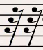
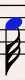

# 拍号与音符时值

## 1. 拍号

五线谱相较简谱多了一个`C`，可用来替代4/4拍。

其它拍号和简谱一样，如6/8拍。

## 2. 休止符

以4/4拍为例，

* 全休止符
  
  
* 二分休止符
  
  
* 四分休止符
  
  
* 八分休止符
  
  
* 十六分休止符
  
  
* 三十二分休止符
  
  

## 3. 音符

以4/4拍为例，

* 二分音符
  
  
* 四分音符
  
  
* 八分音符
  
   
* 十六分音符
  
   
* 三十二分音符
  
  