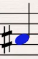
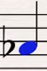
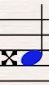
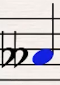
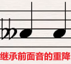
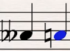
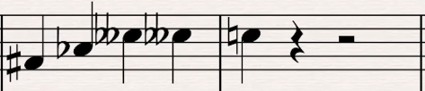

# 升降号与还原号

* 升A:在音符A左边加#变`#A`
  
  
* 降A:在音符A左边加♭变`♭A`
  
  
* 重升A:在音符A左边加x变`xA`
  
  
* 重降A:在音符A左边加♭♭变`♭♭A`
  
  

## 1. 继承

若如上图所示，后面的音A会继承前面音A的重降(即使没加重降号)，即`重降A，重降A`。

**继承的必要条件**:
1. 同一小节
2. 同样的音，音符不同也无所谓。

## 2. 还原号

如上一节的继承，如果不想要继承，就是想使用原本的音，需要加还原号。

如：

音为:`重降A，A`

>虽然不同小节不会继承，但为了容易识别，也可以加上还原号标记，知道之前的小节中该音有被升降过，不过在本小节中应该用它本来的音。

## 3. 练习

音名:`#F(3)，♭A(3)，♭♭C(4)，♭♭C(4) | C(4)`

括号中的数字表示钢琴窗的第几组。