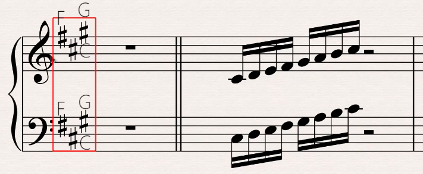
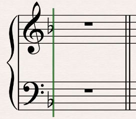

# 调号

五线谱不像简谱一样，会用`1=X`告诉你这是什么调，它会在高音谱号和低音谱号右侧使用**升降号**来通过升降该行音名，来提示该曲子是什么调。

如果音谱号右侧没有升降号，则默认为C大调。

## 1. 举例

### 1.1 A大调

而如下图的A大调所示，升号分别出现在：

* 第三间：C
* 第五线：F
* 上加一间：G

则表示凡是后面的音符出现在该音上（无论哪一组）时，都得升半音，



而A大调的音名为：`A,B,#C,D,E,#F,#G,A`，可见确实只要将CFG各升半音，即可完成音阶`do re mi fa sol la si`的音。

### 1.2 F大调



如上图，降号出现在第三线上，即B音上，后面所有的B音都是降B。

F大调音名为：`F,G,A,♭B,C,D,E,F`。

## 2. 巧记口诀

不用去看升号或者降号在哪个音上，通过口决可以快速知道哪些音在升降：

* `#`号类：4152637
* `♭`号类：7362514

```
4  5  6  7
| /| /| / 
|/ |/ |/
1  2  3
```

>口决是建立在C大调上的各个音名上的，即1=C,2=D...6=A,7=B。

### 2.1 口诀使用

以A大调举例，


可以看见有3个升号，根据口诀，数出前3个音得出415，在C大调中的音名分别对应FCG，那么在演奏时便知道，在碰到FCG时，统统加半音即可。

再以F大调为例,


可见有1个降号,通过口诀数出前1个音为7，在C大调中的音名为B，演奏时，B变为`♭B`即可。