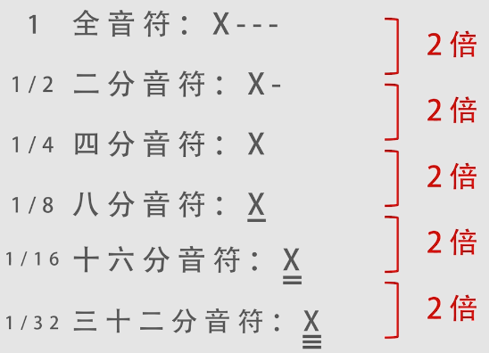
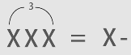
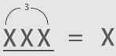
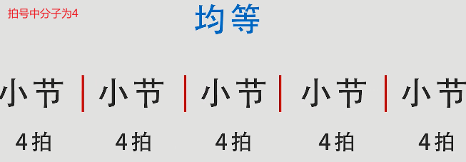
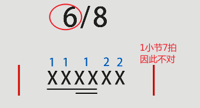

# 音符与节拍（节奏）

## 1. 音符时值及表示方法

音符时值：音的长短。

音符之间的关系与表达方式如下：



### 1.1 附点音符

非独立，和名字表达的意思一样，需要附着在上面的音符后面构成的特殊音符。

模糊记为**附点X分音符**，如附点四分音符，附点八分音符...
>也可以说成X分音符的附点音符。

```
时值：附点X分音符=X分音符+X分音符的一半。
```

**例**：

附点4分音符，记作`X·`
时值上为`4分音符+4分音符的一半（8分音符）`

附点8分音符，记作
时值上为`8分音符+8分音符的一半（16分音符）`

### 1.2 三连音

X分音符的三连音。

将一个整体的时值三等分。

如4分音符的三连音，是由2分音符的时值作为一个整体进行了三等分构成。



如8分音符的三连音，是由4分音符的时值作为一个整体进行了三等分构成。



>8分音符三连音和三个8分音符的时值是不一样的。
>1. 8分音符三连音的时值实际上是一个4分音符的时值
>2. 三个8分音符是一个4分音符+一个8分音符的时值

## 2. 拍号

一首歌的节奏律动。

以**分数**的形式来表达。

常见分数为`4/4`：44拍，4分音符（**分母**）为一拍，每小节有4拍（**分子**）。

在4分音符为1拍的情况下，**因为2分音符的时值为4分音符的2倍**，那么2分音符为2拍。更多情况如下表格所示。

音符|拍值
:-|:-:
全音符|4拍
二分音符|2拍
四分音符|1拍
八分音符|半拍
十六分音符|1/4拍
三十二分音符|1/8拍

>小节：竖线为小节线，歌曲就是由多个小节所构成的。
>
>
>
>1. 拍号不变，那么各个小节的时值均等。
>2. 无论某个小节里的音符怎么变化，一个小节只能有4拍。

如果拍号为`6/8`拍：86拍，8分音符为1拍，1个小节有6拍。

音符|拍值
:-|:-:
全音符|8拍
二分音符|4拍
四分音符|2拍
八分音符|1拍
十六分音符|半拍
三十二分音符|1/4拍

**例题**：



## 3. 打拍子

和广播体操喊的差不多，

比如
* 1小节2拍：12 12 12
* 跑步时的1小节4拍：1234 1234
* 或者体操时的1小节8拍：12345678 22345678

每一拍的时值是一样的，以4拍为例，即喊1、2、3、4时，喊每个数字的时间是一样长的。

### 3.1 每小节中的拍子强弱

>仅了解，实际歌曲中并没有这么强硬、死板的强弱关系。

每小节的拍子总数|强弱
:-|:-
2拍|**强**弱
3拍|**强**弱弱
4拍|**强**弱*次强*弱
6拍|**强**弱弱*次强*弱弱