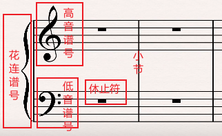
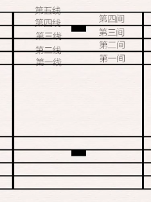
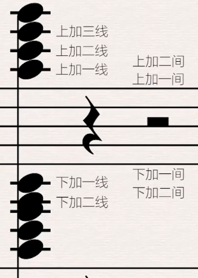
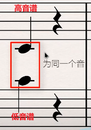

# 线与间

>* 五线谱绘制软件：sibelius
>* 钢琴窗音乐制作软件：cubase

## 1. 初识

## 2. 线与间

### 2.1 基本

由底部向上分别为第一线到第五线，其中的空称为间：第一间到第四间。

### 2.2 添加

无论是高音谱还是低音谱的五根线，都可以在原先的基础上添加线。

**注意：**

高音谱的**下加一线上的音**和低音谱的**上加一线上的音**是同一个音。

**规律：**

有了这个等式的标准后，那么高音谱上每下一根线后的音，其实就和低音谱上的下一根线的音相等。

**例子：**

如高音谱的下加二线上的音，其实就是低音谱的第五线上的音。