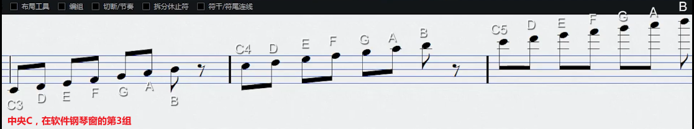
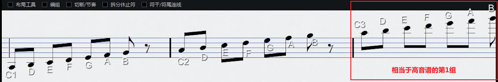
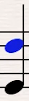
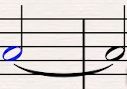

# 音名、符干与连音线

## 1. 音名

### 1.1 高音谱

C3在高音谱的下加一线（低音谱的上加一线）

主要记住：

* C3：下加一线
* C4：第三间
* C5：上加二线

### 1.2 低音谱

主要记住：

* C3：下加二线
* C4：第二间
* C5：上加一线（高音谱的下加一线）

## 2. 符干

* 在三线以下，符干向上，
* 在三线以上，符干向下。

若在同一列，有两个音符，以先放置的音符的符干方向为准，如：

显然黑色的音符是先放置的，它在三线以下，因此符干向上，

此时在同一列再放蓝色的音符，因为它是后放置的，所以符干方向服从先放置的。

## 3. 连音线

与简谱的连音线意思一样，

