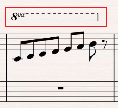
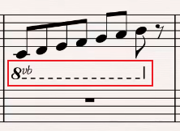
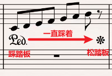
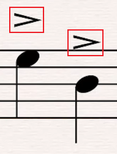
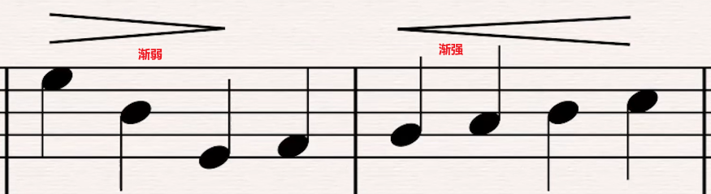
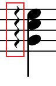

# 标记

在五线谱中，为了方便产生了各种标记。

## 1. 高低八度标记

通过**高八度标记**，让在该范围内的音全部升八度。

如下例将C3组的音全升到了C4组。

---

通过**低八度标记**，让在该范围内的音全部降八度。

如下例将C3组的音全降到了C2组。

## 2. 踏板标记

## 3. 重音

如果音符上有重音标记，那么在弹奏这个音符时，力度相对来说要更大一点。

>人声的话，唱得坚强有力一点。

## 4. 渐弱、渐强

* 渐弱：人声越来越弱，弹奏力度越来越小；
* 渐强：人声越来越强，弹奏力度越来越大。

## 5. 琶音

琶音( arpeggio)指一串和弦音从低到高或从高到低依次连续奏出，可视为分解和弦的一种。

上图中的`GCE`是C大三和弦`CEG`的第二转位，即五音G通过转位成了最低音。