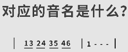
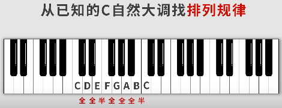
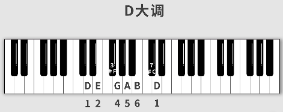
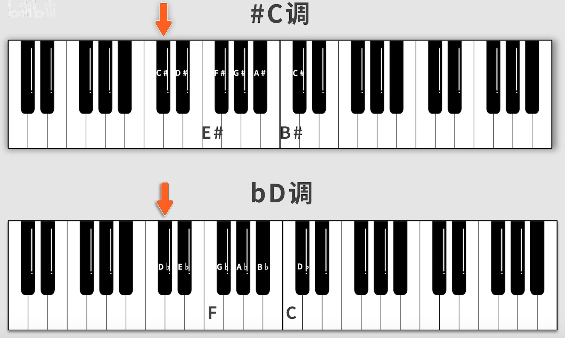
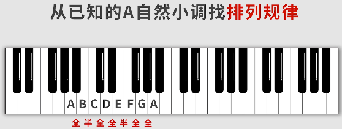
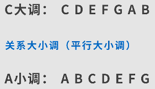

# 调式

>一组有12个键，就有12个调，即从某个键开始的`do re mi fa sol la shi`

## 1. 唱名与简谱数字

简谱|1|2|3|4|5|6|7
:-:|:-:|:-:|:-:|:-:|:-:|:-:|:-:
唱名|do|re|mi|fa|sol|la|si
音名|C|D|E|F|G|A|B

上述表格中，简谱的数字**一定**与唱名一一对应，但却**不一定**与音名一一对应。

音名由大字组小字组来区分不同的组，简谱数字使用点来区分不同的组：

八度就是钢琴键盘的一组。

## 2. 自然大调（白键）

上一节说过，简谱的数字不一定与音名一一对应，如下图简谱所示：

简谱中的1不一定代表音名C。

因此在简谱上方，需要给出明确的定义：`1=X`。

如常见的`1=C`，作用有如下两种：

1. 找C的位置。
   >而C在钢琴键盘上有很多个，此时看数字1，若其上下没有加点的话，一般是指小字1组的C，即中央C。
2. 曲子的调式。
   >基本上的流行歌曲都是会被限定在某个调式里，发展它的旋律以及和声。

调式分很多种，如**自然调式**，自然调式又分大小，该节讲**自然大调式**（流行歌曲中最常用的一种）。

因为最常用，因此`1=C`表示**C自然大调**的意思。

>`1=C`很特别，刚好可以让简谱数字与音名一一对应，且都落在白键上。

### 2.1 调式内部排列规律

不管`1等于几`，调式内部排列规律都**一致**，比如自然大调听起来都是`do re mi fa sol la si do`

因此大调的排列规律都是`全 全 半 全 全 全 半`

**例1**：F大调（1=F）

>注意`#F`(升F)不能是`G♭`(降G)，因为调式内的音名必须要**出现**且按照**顺序**，如果是降G，整个调式就没有F了，这是不行的。

**例2**：D大调（1=D）

## 3. 自然大调（黑键）

因为黑键是在白键为基础上的命名。因为升降号的存在，黑键可以同时有两种命名，理论上来说，以同一黑键开头的调式有两种说法，如下图的`#C`大调和`♭D`大调。

从上图中可以看出两种不同说法的调式的写法区别不是很大，但如果出现下面的情况：

从上图中，会发现使用“升式”写法，竟然出现了重升的标记，使整个调式更加复杂，然而采用“降式”写法，明显简单明了。

因此，实际常用的是使用“降式”写法来写**以黑键开头**的大调。

## 4. 自然小调

以唱名`la`为首音。

唱名|la|si|do|re|mi|fa|sol
:-:|:-:|:-:|:-:|:-:|:-:|:-:|:-:
简谱|6|7|1|2|3|4|5

其中`A小调`特殊，其音名刚好与简谱数字一一对应，且都落在白键上。

可见自然小调的规律为`全 半 全 全 半 全 全`

## 5. 通过关系大调快速得到小调

由上一小节可知，要推出小调的音阶（音名写法），通过小调规律来推容易和大调规律记混，

因此，可以只记大调的推理方法，然后得到小调的音阶。因为大调与小调之间有如下关系。

具体的方法如下（通过具体例子讲解）：

### 5.1 推理A小调

1. 找到白键A，
   
2. 然后向右跨越`1个全音+1个半音`，
   
3. 然后找以`C`为首音的大调，
   
4. 然后把简谱6、7对应的音名挪到前面，便找到了`A小调`。
   

### 5.2 推理E小调

1. 找到白键E，
   
2. 然后向右跨越`1个全音+1个半音`，
   
3. 然后找以`G`为首音的大调，
   
4. 然后把简谱6、7对应的音名挪到前面，便找到了`E小调`。
   

## 6. 大小调的区别（听感）

普通人通常认为：

* 大调：欢快、明朗
* 小调：暗淡、忧伤

但这并不是绝对的，即使是大调也能写出悲伤的曲子，小调也能写出激昂，洗脑的曲子。