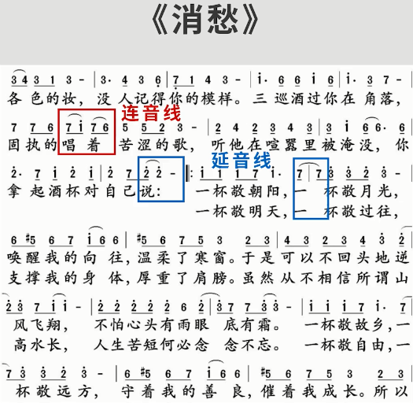

# 简谱

## 1. 休止符

无论是演唱还是演奏，都有需要“换气”的时候。

在简谱中，由`0`表示。

比如：

## 2. 延音线与连音线

在简谱中都是音符上有一条弧线构成。

### 2.1 延音线

概念：多个**相同高音**的音连在一起，**变为一个音**。

比如，在`4/4拍`下，

如上图中所写，需要唱两次`do`,

如果像上图中加上`延音线`，就只唱一次`do`，时值为两个音符加在一起。

### 2.2 连音线

歌词中某个字可能要发多个音，即**一字多音**，此时需要将该字**开头的音**和**结尾的音**用连音线连起来。

### 2.3 例子

