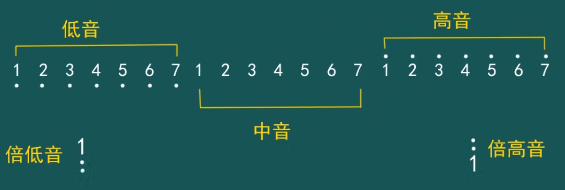
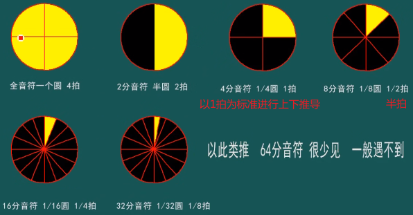
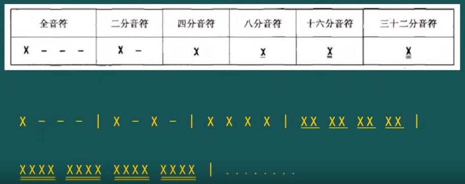

# 简谱

简谱比五线谱书写简单，方便。

简谱|1|2|3|4|5|6|7
:-:|:-:|:-:|:-:|:-:|:-:|:-:|:-:
唱名|do|re|mi|fa|sol|la|si
音名|C|D|E|F|G|A|B

>**和弦**和**调式**会用到音名

## 高低音记录

## 长短音记录

**前缀知识**

乐谱的**音乐节拍**及**音符划分**

**长短音**

上图解释：

* X: 表示`do` `re`...任意一个。
* -: 
  * 写在X的后面，表示**增时线**
  * 写在X的下面，表示**减时线**

## 休止符

用`○`表示：只打拍子不演奏。长短音记录同上一小节。